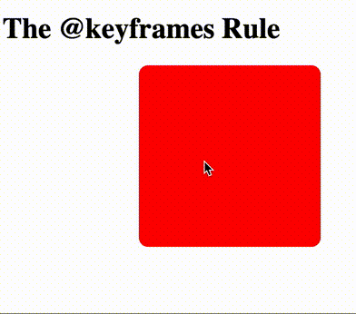

# Animationen mit CSS

Mit CSS-Animationen können die meisten HTML-Elemente ohne JavaScript oder [Flash](https://www.youtube.com/watch?v=oHg5SJYRHA0) animiert werden!

Hier eine [Übersicht](https://developer.mozilla.org/en-US/docs/Web/CSS/CSS_animated_properties) vom Mozilla Developer Network welche CSS Parameter zunächst animiert werden können. Lea Verou hat eine [übersichtliche Seite](http://leaverou.github.io/animatable/) gestaltet mit verschiedenen Animationen gestaltet. Sie verändert jeweils nur einen CSS Parameter und animiert zwischen zwei Werten. Sie ist auch die Autorin vom Buch "[CSS Secrets](https://www.amazon.com/CSS-Secrets-Lea-Verou/dp/1449372635?tag=leaverou-20)".

Erstellen wir eine simple Animation:



Hier werden insgesamt drei Parameter animiert. Welche? 
<details>
<summary>Lösung</summary>
<p>

```css
transform: rotate(90deg) scale(2);
left: 200px;
```

</p>
</details> 

Zuerst erstellen wir unsere Animation mit der Regel @keyframes. Diese hat folgende Struktur:

```css
@keyframes <animation-name> {
      keyframe selector {
        css styles here ....
      }
    }
```


