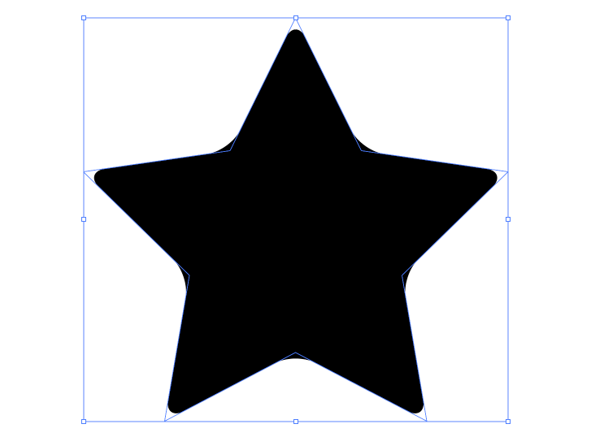
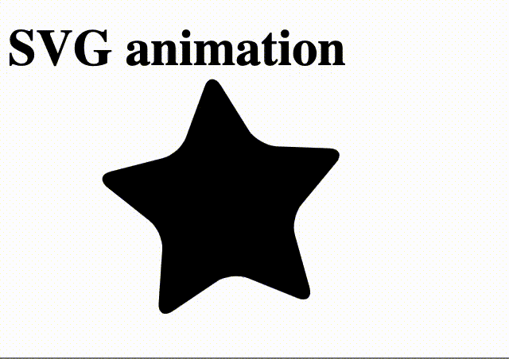

# SVG Graphiken animieren

[SVG](https://svgontheweb.com) steht für Scalable Vector Graphics. Es ist ein XML-basiertes Vektorformat für zweidimensionale Graphiken welche animiert und interaktiv fürs Web verwendet können.

Eine (rote) Linie als SVG könnte so aussehen: 

```xml
<svg>
    <line stroke="#ff0000" x1="0.4" y1="78.2" x2="78.2" y2="0.4" />
</svg>
```

Dieser Code kann direkt ins HTML eingefügt werden. Es handelt sich deshalb um eine Inline SVG. Mehr zu den Grundformen vom SVG Format hier unter diesem [Link](https://www.w3schools.com/html/html5_svg.asp).

Illustrator (bzw. [Inkscape](https://inkscape.org/)) arbeiten ebenso mit Vektorgraphiken. Diese können bis zu einer gewissen Komplexität direkt in den HTML Code eingebunden werden. v

Hier ein einfacher Stern als Vektorgraphik, welche im Illustrator selektiert wurde:



Und hier dieselbe Vektorgraphik im Browser animiert:


